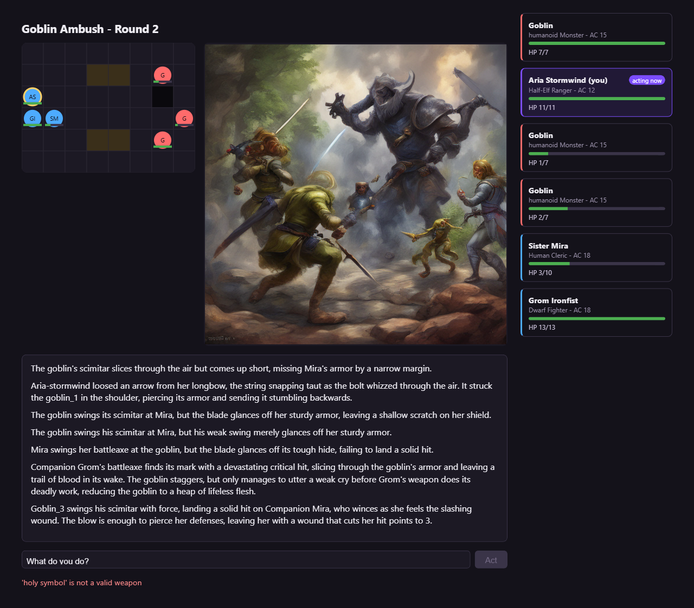
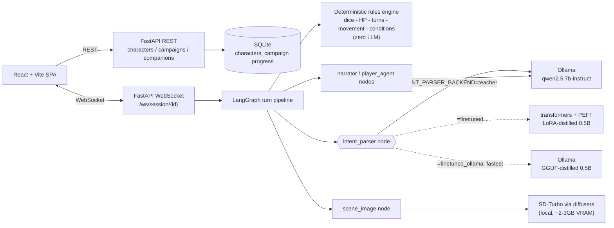
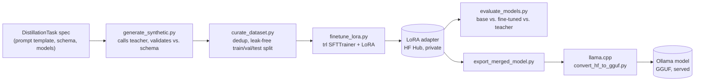
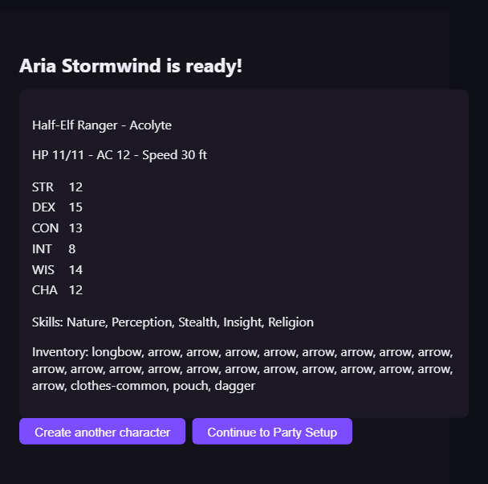
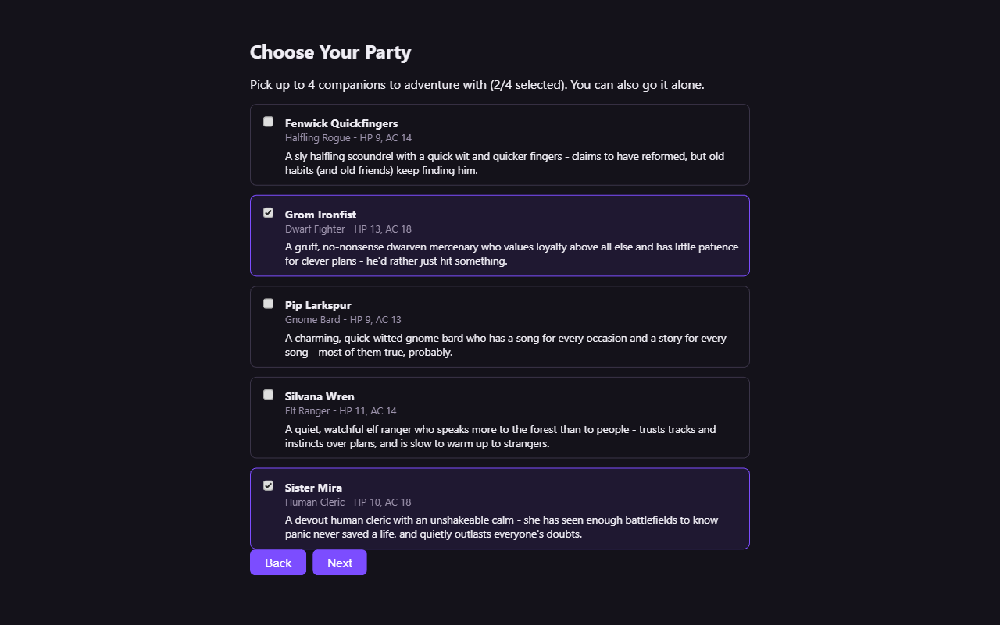
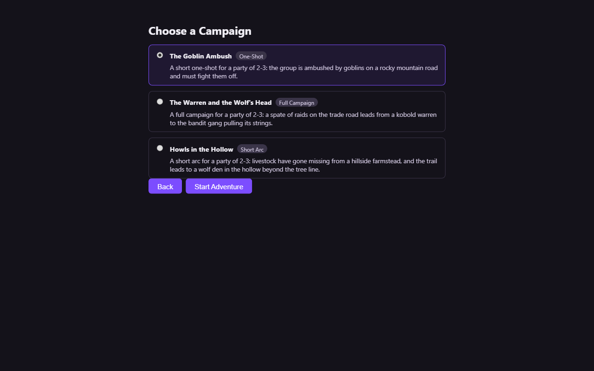
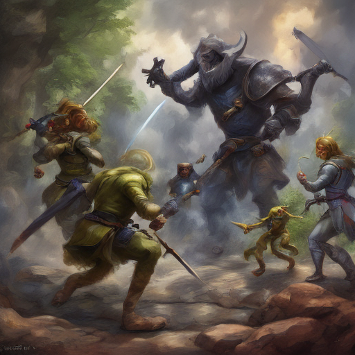

# agentic-dm-engine

A playable, fully local AI Dungeon Master for D&D 5e. A deterministic rules engine (dice, HP, turns, movement, conditions — zero LLM) drives the mechanics; local models (via [Ollama](https://ollama.com)) handle intent parsing, narration, and companion role-play; a locally distilled model replaces the 7B intent-parser with one 14x smaller; and local Stable Diffusion renders a scene image every round. No cloud API calls anywhere in the loop.



## What it does

- **Full SRD-driven character creation** — race, standard-array/point-buy ability scores, class + skill choices, background, starting equipment. Every derived stat (HP, AC, proficiency bonus, spell slots) comes from a deterministic, fully unit-tested engine, not an LLM guess.
- **Party setup** — bring 0-4 AI companions from a hand-authored roster (each with a real character sheet and a persona), or go it alone.
- **Three campaigns, one generator** — a One-Shot, a Short Arc, and a Full Campaign, hand-authored; plus `generate_campaign` (teacher-model-composed, schema-validated, immediately playable — see below).
- **Live play** — free-text actions over a WebSocket, an SVG combat grid with click-to-move, live HP/condition tracking, a narration feed, and a scene image regenerated at the start of each round.
- **A reusable LLM distillation toolkit** — not a one-off fine-tuning script. `DistillationTask` + generic synthetic-data-generation/curation/eval works against *any* pydantic schema; the intent parser is its first real use case (see [Results](#headline-results) below).

## Architecture



`src/engine/` is the deterministic core (dice, state, turn order, movement, rules, conditions, character creation, campaigns) — plain Python, fully unit-tested, no LLM call anywhere in that path. LLMs are used only to parse free text into a structured action, narrate resolved events, role-play companions, judge playthrough quality, and prompt the image model. Full rationale for every non-obvious choice (React over vanilla JS, SQLite over Postgres, SD-Turbo over SDXL, linear-not-branching campaigns, the distillation toolkit's design) is in [DECISIONS.md](DECISIONS.md).

### The distillation toolkit



The pipeline (`src/training/`) is schema-agnostic — it was proven against a throwaway "extract name+age from a sentence" task with zero D&D-specific code before the intent parser ever touched it. Adding a second distillation target (e.g. a narration-quality judge) means writing a new `DistillationTask`, not touching the pipeline.

## Headline results

### Distilling the 7B intent parser down to 0.5B

The teacher model (`qwen2.5:7b-instruct`) parses free text into a structured `ParsedAction` correctly, but a raw untrained 0.5B model given the same prompt cannot — it emits valid JSON but drops the required schema fields. After fine-tuning Qwen2.5-0.5B-Instruct with LoRA (r=16, 3 epochs, ~56 min on an RTX 3080, 7,000 synthetic examples) it closes almost all of that gap:

| model | valid JSON | valid `ParsedAction` | field accuracy |
| --- | --- | --- | --- |
| base Qwen2.5-0.5B (no fine-tune) | 100.0% | 0.0% | 53.0% |
| **fine-tuned Qwen2.5-0.5B (LoRA)** | 100.0% | 100.0% | **98.4%** |
| teacher (Qwen2.5-7B-Instruct) | 100.0% | 100.0% | 99.2% |

300 held-out test examples. Full table (per-field breakdown) and per-example predictions: [`data/training/eval_results/intent_parser_eval.md`](data/training/eval_results/intent_parser_eval.md).

### Serving the distilled model efficiently

A smaller model only helps in production if it's also served efficiently. Naively serving the fine-tuned 0.5B through `transformers`/`peft` was barely faster than the 7B teacher on Ollama's `llama.cpp` backend — the inference *stack* mattered more than parameter count at this scale. Converting the fine-tuned model to GGUF and serving it through Ollama (the teacher's own engine) fixes that:

| backend | parse latency (median) | field accuracy |
| --- | --- | --- |
| teacher (Ollama, 7B) | ~1000 ms | 99.2% |
| fine-tuned, `transformers`/`peft` (0.5B) | ~2700 ms | 98.4% |
| **fine-tuned, GGUF via Ollama (0.5B)** | **~500 ms** | **98.3%** |

The bigger win, found chasing this benchmark rather than by design: a Windows-specific `httpx`/`localhost` resolution issue was silently adding ~2.2s to *every* local LLM call in the app. Fixing it (point at `127.0.0.1` instead) sped up every call the app makes, not just the parser — a full autoplay round now takes **~7.1s**, down from ~15-20s. Full writeup: [`CLAUDE.md`](CLAUDE.md)'s Day 27 detour entries.

### VRAM budget (RTX 3080, 10GB)

Measured live, not estimated: the Ollama teacher (~5.85GB) and the local SD-Turbo image pipeline (~2-3GB) coexist at **~9.55GB** combined with a generation in flight — no GPU model-swap orchestration needed. `SCENE_IMAGES_ENABLED=0` frees the image model's ~3GB if you want to run a student backend alongside the teacher too.

## Screenshots

| Character creation | Party setup | Campaign select | Scene art (SD-Turbo) |
| --- | --- | --- | --- |
|  |  |  |  |

## Tech stack

Python 3.13 ([uv](https://docs.astral.sh/uv/)), FastAPI + SQLAlchemy/Alembic (SQLite), [LangGraph](https://github.com/langchain-ai/langgraph) for turn orchestration, [Ollama](https://ollama.com) (`qwen2.5:7b-instruct`) for the teacher LLM, `transformers`/`peft`/`trl` for LoRA fine-tuning, `diffusers` (`stabilityai/sd-turbo`) for local image generation, React 19 + Vite + TypeScript for the frontend.

## Setup

```bash
uv sync
uv run python scripts/download_srd.py   # vendors D&D 5e SRD 5.1 content
uv run alembic upgrade head              # creates the local SQLite DB
uv run pytest                            # 206 offline tests, no live model needed
```

Playing the game live needs [Ollama](https://ollama.com) running with `qwen2.5:7b-instruct` pulled (`ollama pull qwen2.5:7b-instruct`):

```bash
# Terminal 1
uv run uvicorn src.api.main:app --port 8000
# Terminal 2
cd web && npm install && npm run dev
```

Then open http://localhost:5173 and play through: create a character → pick companions → pick a campaign → live play.

**Fastest way to see it work end-to-end without the UI** — a full autoplay run with 2 AI companions, zero human input, a scored transcript, and real scene images:

```bash
uv run python -m src.cli.play --autoplay --campaign goblin_ambush_oneshot
```

Full command reference (training/eval pipeline, campaign generator, alternate intent-parser backends, etc.): [`CLAUDE.md`](CLAUDE.md).

## SRD 5.1 attribution

This project uses content from the D&D 5th Edition System Reference Document 5.1 ("SRD 5.1") by Wizards of the Coast LLC, available at https://dnd.wizards.com/resources/systems-reference-document, licensed under the Creative Commons Attribution 4.0 International License (https://creativecommons.org/licenses/by/4.0/legalcode). No other Wizards of the Coast content is used. See `data/srd/ATTRIBUTION.md` (generated by `scripts/download_srd.py`) for the full notice and data source.

## Further reading

- [`DECISIONS.md`](DECISIONS.md) — ADR-style log of every non-obvious architecture choice and why.
- [`CLAUDE.md`](CLAUDE.md) — commands, architecture summary, and a day-by-day engineering log of real bugs found and fixed while building this.
